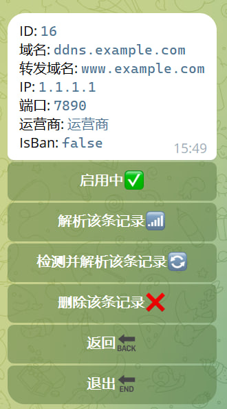

# telegram-bot-DDNS
[telegram-bot-DDNS](https://github.com/reppoor/telegram-bot-ddns)

[telegram频道](https://t.me/ddns_reppoor)
### 一款Telegram动态域名解析机器人
仅支持IPV4，IPV6请绕道

需要准备一台IP地区为中国的VPS

仅接受cloudflare托管的域名


# 开发环境
GO >= 1.21.4

MYSQL > =  5.7.34

# 运行方式
## docker运行
### 1.安装aaPanel
```
URL=https://www.aapanel.com/script/install_7.0_en.sh && if [ -f /usr/bin/curl ];then curl -ksSO "$URL" ;else wget --no-check-certificate -O install_7.0_en.sh "$URL";fi;bash install_7.0_en.sh aapanel
```
### 2.进入aaPanel安装docker和mysql，并创建好数据库

### 3.需要进行在宿主机创建conf.yaml文件，路径可以自定义，复制以下内容进行对应完善并保存
```
database:
  user: "" # 数据库用户名
  password: "" # 数据库密码
  host: "" # 数据库主机
  port: "3306" # 数据库端口
  name: "" # 数据库名称
  charset: "utf8mb4" # 字符集

telegram:
  id :  #telegram用户ID
  token : "" # telegram机器人Token找@BotFather创建
  apiEndpoint: "https://api.telegram.org" #telegramAPI 可以反代，如果不知道在做什么，请不要更改

cloudflare:
  email: "" #cloudflare的email
  key: "" #cloudflare的key

network:
  enable_proxy: true # 开启:true,关闭:false。开启后一定要保证代理语法正确，否则程序报错
  proxy: "http://127.0.0.1:7890" #配置telegram代理，支持http和socks5。示例语法 socks5://127.0.0.1:7890

check:
  ip_check_time : 3 # 单位秒Second
  check_time: 10 #单位分钟Minute (建议超过5分钟，否则报错)

```
### 4.下拉docker镜像并运行容器
将/path/conf.yaml替换为宿主机的原文件路径
```
docker pull reppoor/telegram-bot-ddns:latest && docker run -d -v /path/to/your/conf.yaml:/app/conf.yaml reppoor/telegram-bot-ddns:latest
```

# 初始化机器人
找@BotFather，进入自己的机器人

1.点击Edit Bot

2.点击Edit Commands

3.输入如下命令发送
```
start - 开始
id - 获取ID
init - bot初始化
info - 转发信息
insert - 插入转发记录
check - 检测连通性
```
在docker启动后首先点击该命令，否则无法使用
```
/init 进行初始化数据库，否则无法使用
```
## Stargazers over time
[](https://starchart.cc/reppoor/telegram-bot-ddns)